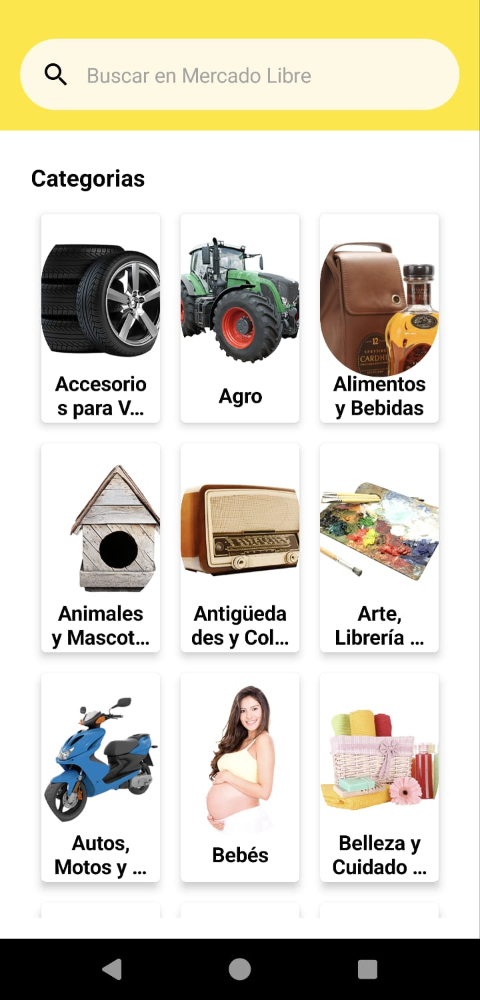
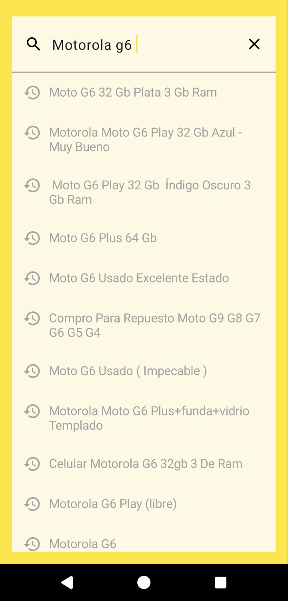
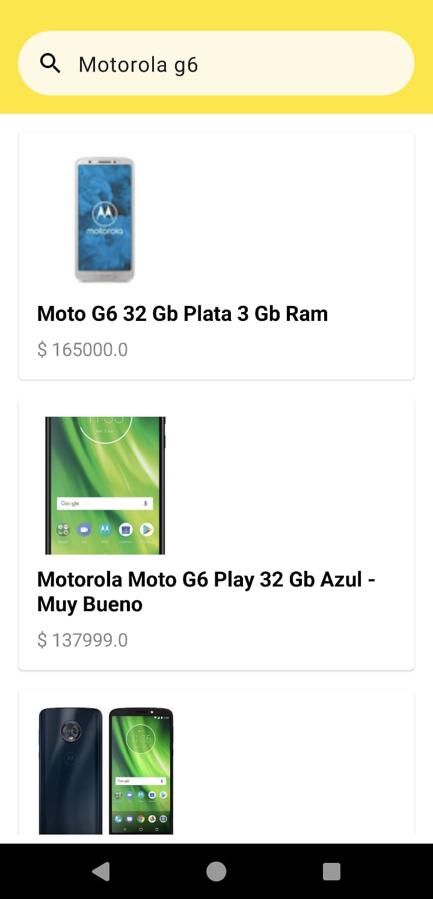
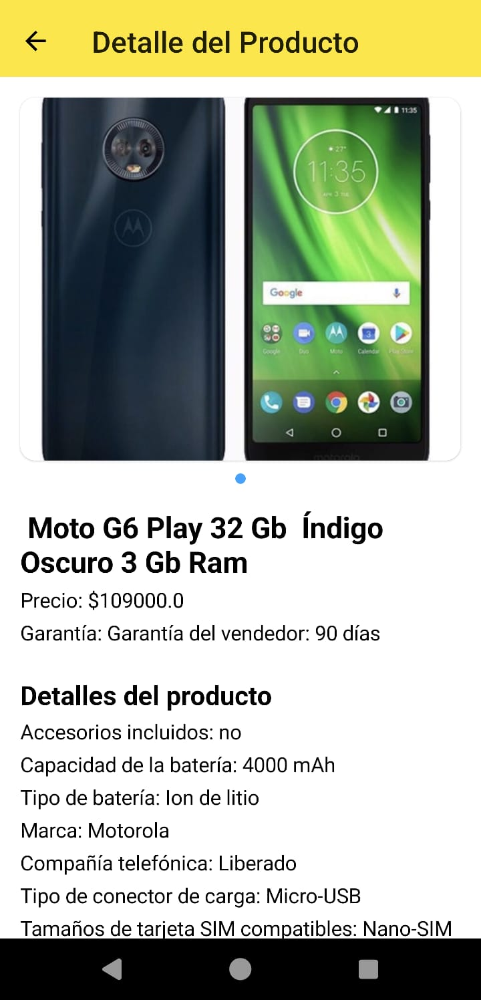

# Aplicación prueba técnica Mercado Libre

## Descripción

AppMercadoLibre es una aplicación de ejemplo que utiliza la API de MercadoLibre para mostrar productos y detalles.

## Características

- Buscar productos por barra de busqueda
- Buscar productos por Categorias
- Ver detalles de productos

## Tecnologías y arquitectura  utilizadas 

- Kotlin
- Jetpack Compose
- Patron de arquitectura: Model-View-ViewModel (MVVM)
- Inyeccion de dependencias con Daagger Hilt
- Patron Repository
- Patron Interactor: Casos de uso
- Clean Arquitecture
- Navigation Component
- Corourtines
- Libreria LeackCanary para los merory leacks


## Descargar Apk
[Descargar APK](apk_app/AppMercadoLibre_ver_1.apk)

## Configuración del Proyecto

1. Clona el repositorio:

   ```bash
   git clone https://github.com/klaussren/AppMercadoLibre.git


## Capturas de Pantalla







